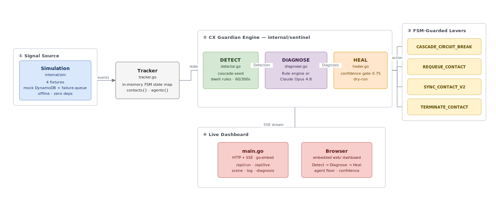
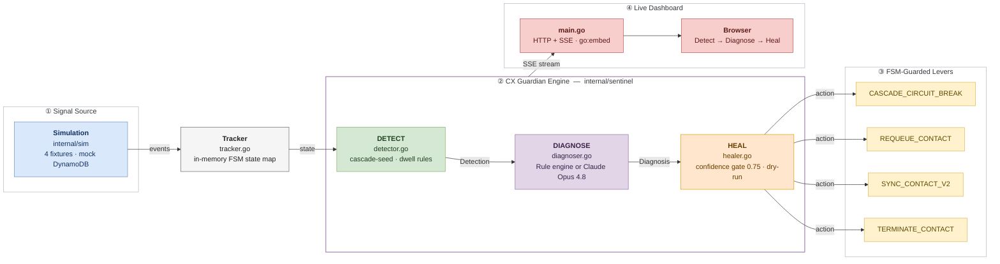

# CX Guardian — Self-Healing Reliability Agent

CX Guardian is an AI-powered reliability agent for NICE CXone Entity Management. It watches the contact center's live event stream, automatically detects when something goes wrong (a failed contact assignment, a stuck contact, a blocked agent), figures out the root cause, and fixes it — before the customer ever notices.

Built as a Sparkathon 2026 prototype. Runs entirely offline with zero external dependencies for the demo.

---

## The Problem It Solves

In a NICE CXone contact center, a single failed `AssignContact` call can trigger a cascading cleanup in the `orch-entity-failure-queue` Lambda. That Lambda wipes the **entire agent record** in DynamoDB — including all healthy contacts on that agent. One real failure becomes 5–7 phantom failures. At scale, this produces roughly **1,000 whole-agent wipes per week** in production.

CX Guardian intercepts this cascade before it fires, quarantines only the failing contact, and preserves the healthy ones. Amplification drops from 5–7× to 1×.

It also handles three other failure modes:

| Failure | What happens without CX Guardian | What CX Guardian does |
|---------|-----------------------------------|-----------------------|
| Contact stuck in ROUTING past ring timeout | Customer waits forever, eventually abandons | Detects dwell, requeues contact in ~1s |
| Agent stuck in ACW past timeout | Agent is blocked, can't take new contacts | Detects dwell, terminates ACW state, frees agent |
| Contact stuck in QUEUING past match SLA | Customer queues indefinitely, no match produced | Detects dwell, re-syncs contact into matching pipeline |

---

## How to Set Up

### Prerequisites

- **Go 1.22 or later** — [download from golang.org](https://golang.org/dl/). The project was developed on Go 1.26.
- **Git** — to clone the repository.
- No Node.js, no Docker, no database, no AWS credentials required for the simulation demo.

### Clone and Build

```bash
git clone https://github.com/vrushabh-dhone/em-sentinel.git cx-guardian
cd cx-guardian
go build -o cx-guardian .
```

The build embeds the entire web dashboard (`web/index.html`, `web/styles.css`, `web/app.js`) directly into the binary using Go's `//go:embed` directive. This means:

- **No separate web server needed** — the binary serves everything.
- **If you change any file in `web/`, you must rebuild** before the change takes effect. The binary bakes the files in at compile time, not at runtime.

### Optional: Enable AI Diagnosis (Claude Opus 4.8)

By default CX Guardian uses an offline rule engine to diagnose failures. To use real AI diagnosis:

```bash
export ANTHROPIC_API_KEY="your-key-here"
./cx-guardian
```

When `ANTHROPIC_API_KEY` is set, the Diagnose step calls Claude Opus 4.8 with the failure context and FSM rules, returning a natural-language root cause explanation with a confidence score.

---

## How to Run

### Start the Server

```bash
./cx-guardian                    # listens on :8080
./cx-guardian -addr :8081        # custom port
go run .                         # build + run in one step (no binary produced)
```

Open your browser at **http://localhost:8080** (or whichever port you used).

### Using the Dashboard

1. **Select a scenario** from the Simulation dropdown — four scenarios are available:
   - **Failure-Queue Cascade** — the flagship scenario, 1 failure → whole-agent wipe
   - **Stuck Contact** — contact stuck in ROUTING past ring timeout
   - **ACW Stuck** — agent blocked in After-Contact Work past ACW timeout
   - **Queue Stuck** — contact stuck in QUEUING past match SLA

2. A **use-case card** appears showing what the scenario models, what goes wrong in production, and how CX Guardian resolves it.

3. Click **▶ Run WITHOUT CX Guardian** to see the unmitigated failure — contacts and agents get wiped.

4. Click **🛡 Run WITH CX Guardian** to see the detection, AI diagnosis, and healing in action.

5. Watch the **DETECT → DIAGNOSE → HEAL** stepper light up as each phase fires.

### Rebuilding After Web Changes

Because the web files are embedded at build time:

```bash
# After editing any file in web/
go build -o cx-guardian . && ./cx-guardian -addr :8081
```

---

## Architecture



<details>
<summary>Mermaid source (renders on GitHub)</summary>



</details>

### How the Phases Work

**DETECT**
The `Detector` inspects every incoming event from the Tracker. For the cascade scenario it looks for a `FailureRecord` where the failing contact is in `ROUTING` state and the same agent has other contacts in healthy states — this is the cascade seed pattern. For stuck contacts it inspects dwell time: how long a contact has been in a given state versus the known timeout for that state (ring timeout ~60s, ACW timeout ~30s, match SLA ~300s).

**DIAGNOSE**
The `Diagnoser` interface has two implementations:
- `RuleDiagnoser` — deterministic offline rules, always available. Maps detection signals to known actions with hardcoded confidence scores.
- `ClaudeDiagnoser` — calls Claude Opus 4.8 via the Anthropic API. Passes the failure context, FSM state, and entity relationships as a structured prompt. Returns a natural-language root cause, recommended action, confidence score (0–1), and explanation.

The `Diagnoser` is a clean interface seam — swapping from rule-based to Claude requires no changes to Detector or Healer.

**HEAL**
The `Healer` receives the diagnosis and applies one of four FSM-guarded levers:

| Lever | What it does | When used |
|-------|-------------|-----------|
| `CASCADE_CIRCUIT_BREAK` | Quarantines only the seed contact, preserves all healthy contacts | Cascade seed detected |
| `REQUEUE_CONTACT` | Re-enters the contact into the matching pipeline | Contact stuck in ROUTING |
| `TERMINATE_CONTACT` | Force-releases a contact stuck in ACW | Agent blocked by ACW |
| `SYNC_CONTACT_V2` | Re-syncs contact state to trigger a fresh match | Contact stuck in QUEUING |

A confidence gate (`AutoBelow = 0.75`) holds actions below 75% confidence for human approval. Above that threshold, the Healer acts automatically. The Healer always runs dry-run against live environments — it proposes the action and logs it, never writing directly to shared state.

---

## Project Structure

```
cx-guardian/
├── main.go                        # HTTP server, SSE streaming, scenario orchestration
├── go.mod                         # Go module (github.com/nice-cxone/em-sentinel)
│
├── web/                           # Embedded dashboard — rebuild required after any change here
│   ├── index.html                 # Page structure: controls, stepper, floor, diagnosis, feed
│   ├── styles.css                 # Dark theme, tile states, stepper states, use-case cards
│   └── app.js                     # SSE client, stepper logic, floor rendering, confidence bands
│
└── internal/
    ├── sentinel/                  # Core engine — the heart of CX Guardian
    │   ├── model.go               # All types: Detection, Diagnosis, HealResult, FSM states, levers
    │   ├── tracker.go             # In-memory FSM state map, fed by ContactStateChange events
    │   ├── detector.go            # Cascade-seed detection + dwell-time inspection rules
    │   ├── diagnoser_rule.go      # Offline rule-based diagnoser (zero dependencies)
    │   ├── diagnoser_claude.go    # Claude Opus 4.8 diagnoser (requires ANTHROPIC_API_KEY)
    │   └── healer.go              # Applies diagnosis to store, enforces confidence gate
    │
    └── sim/                       # In-memory EM runtime (replaces real Kafka + DynamoDB for demo)
        ├── store.go               # Mock DynamoDB: in-memory contact/agent record store with TTL
        ├── failure_queue.go       # Mock orch-entity-failure-queue: whole-agent cleanup + circuit breaker
        └── scenario.go            # Four fixtures: CascadeFixture, StuckFixture, ACWFixture, QueueFixture
```

---

## Key Technical Decisions

### Why Go?
The entire EM platform is Go (Uber fx, franz-go Kafka, gRPC). CX Guardian is built to be a natural extension — the `internal/sentinel` engine is designed to be dropped into any EM service with minimal wiring.

### Why `//go:embed`?
Single binary deployment. The dashboard is baked into the binary at build time so there are no static file paths to manage, no CDN, no separate web server. `go run .` gives you a fully working demo.

### Why SSE (Server-Sent Events)?
The dashboard needs a one-way stream from the server to the browser as the simulation runs step by step. SSE is simpler than WebSockets for this use case — no handshake, native browser support, works over HTTP/1.1, and Go's `http.Flusher` interface makes it trivial to implement.

### Why a `Diagnoser` interface?
The offline rule engine and Claude are interchangeable. The interface seam means the rest of the engine (Detector, Healer, Actuator) has zero knowledge of whether AI is involved. In production you could run both — use Claude for novel patterns, fall back to rules if the API is unavailable.

### Confidence Gate
The `AutoBelow = 0.75` threshold is intentional. Actions with less than 75% confidence are held for human review. This prevents CX Guardian from making things worse when it's uncertain. In the demo, the cascade scenario reliably produces 95%+ confidence (the pattern is unambiguous). Stuck-contact scenarios produce 80–90%.

### Safety by Design
- **Live mode is always dry-run** — the Healer logs what it would do but never writes to shared environments.
- **No PII in logs** — contact/agent IDs are numeric keys, never names or customer data.
- **FSM-guarded levers** — healing actions go through existing FSM-validated paths, not direct DynamoDB writes.
- **BU validation** — every operation validates the business unit to prevent cross-tenant access.

---

## Mapping to Real Entity Management

This is a faithful skeleton. Replace `internal/sim` with real infrastructure and the engine is unchanged:

| CX Guardian (prototype) | Real EM equivalent |
|-------------------------|--------------------|
| `internal/sim/store.go` | DynamoDB via `orch-entity-common/persistence` |
| `internal/sim/failure_queue.go` | `orch-entity-failure-queue` Lambda (`recordprocessor.go`, `entityoperations.go`) |
| `Tracker` (in-memory FSM map) | Fed by `orch-entity-streams` `GenericHandler` consuming `ContactStateChangeV2` / `AgentContactStateChangeV2` |
| `Detector` cascade-seed rule | Matches log marker `"Agent record ttl set"` at `entityoperations.go:76` |
| `RuleDiagnoser` | Can be augmented with Claude call — `Diagnoser` interface is the seam |
| `Healer` levers | Protobuf commands published to Contact/Agent Command topics (FSM-validated) |

---

